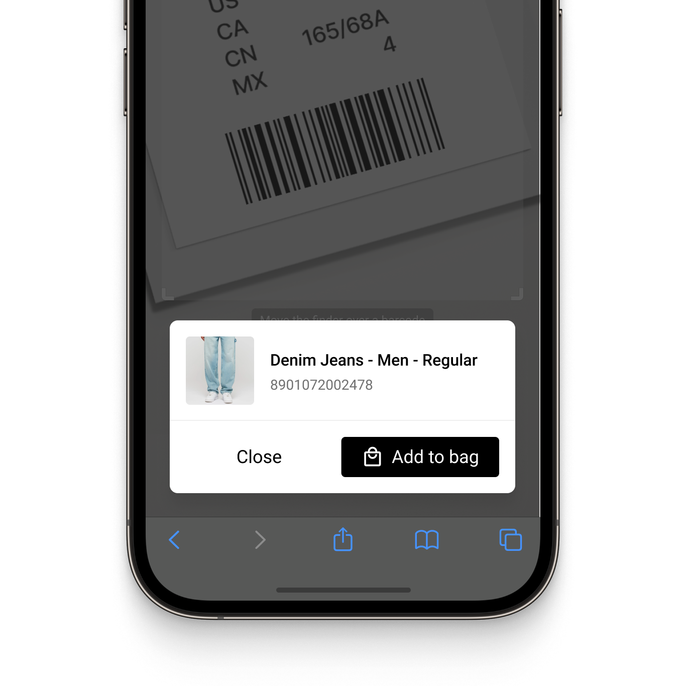
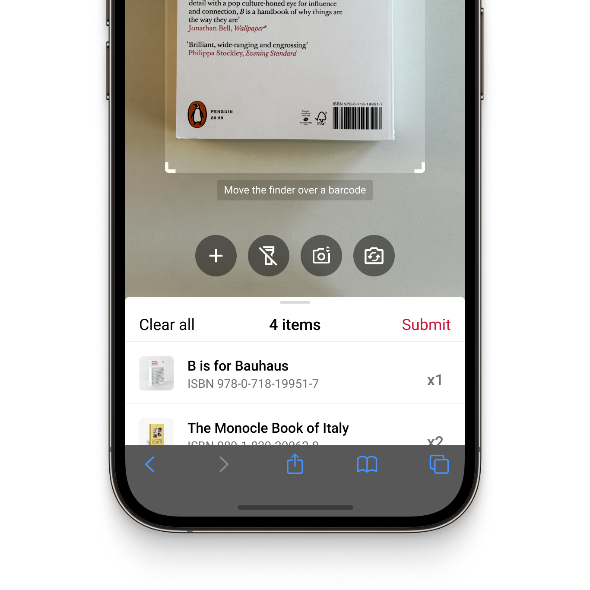
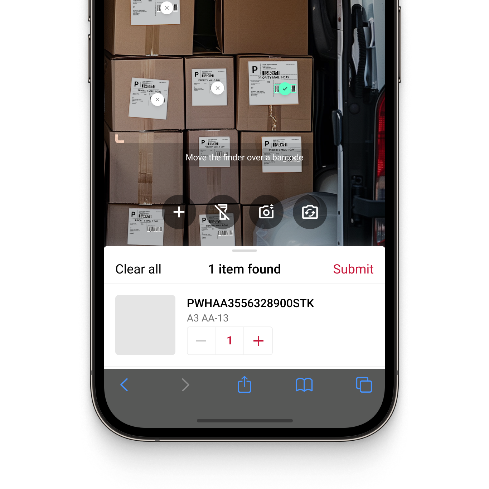
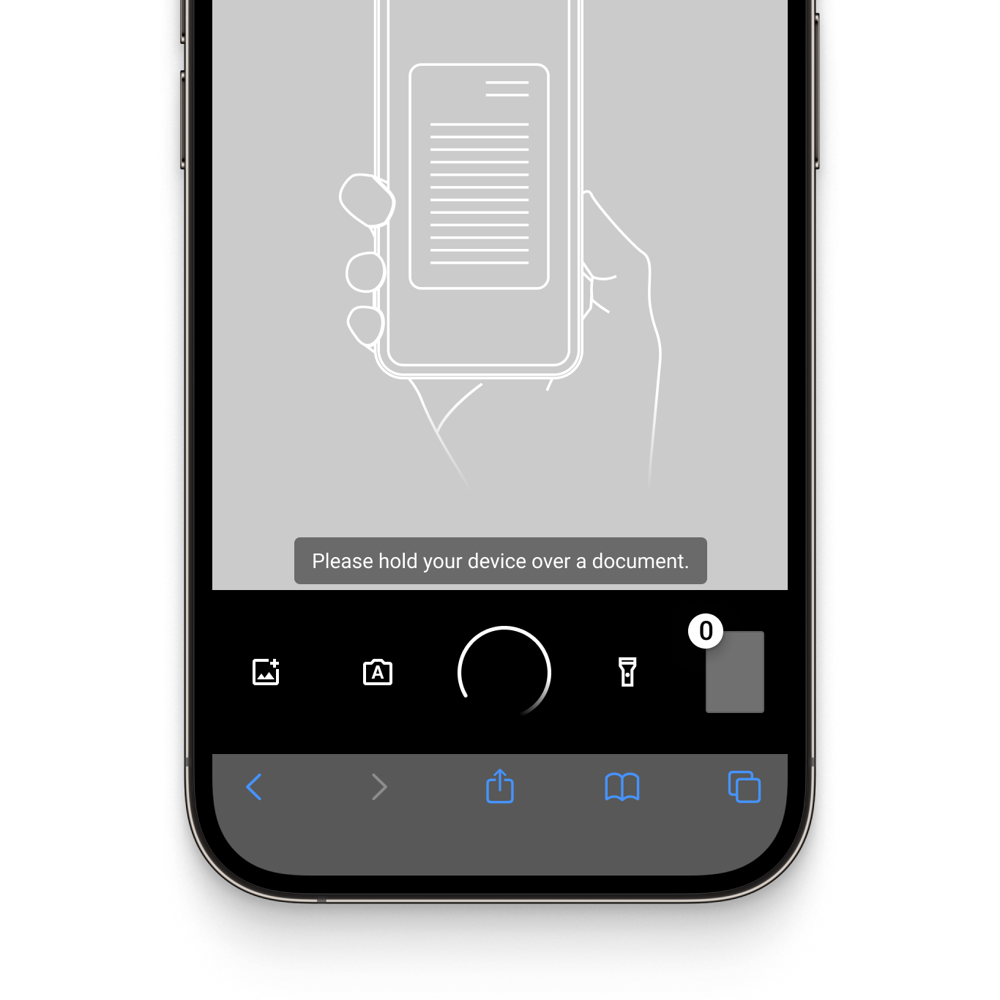
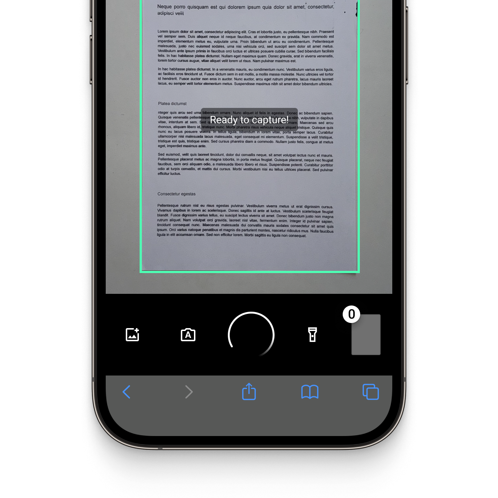
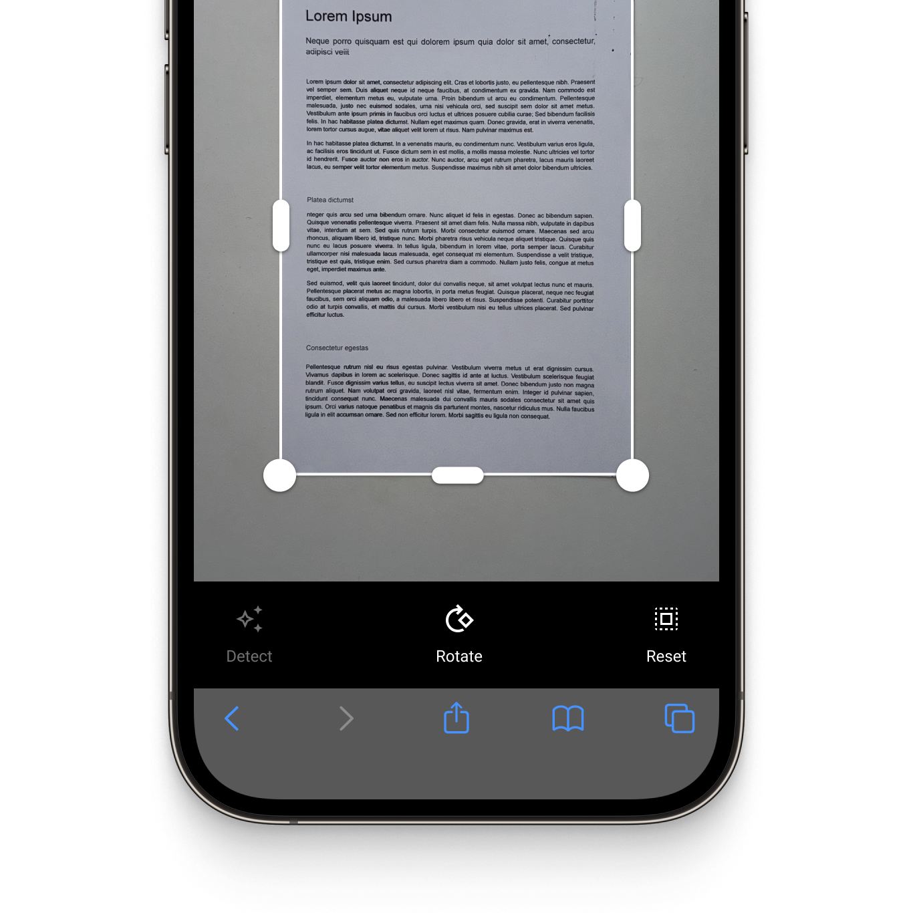
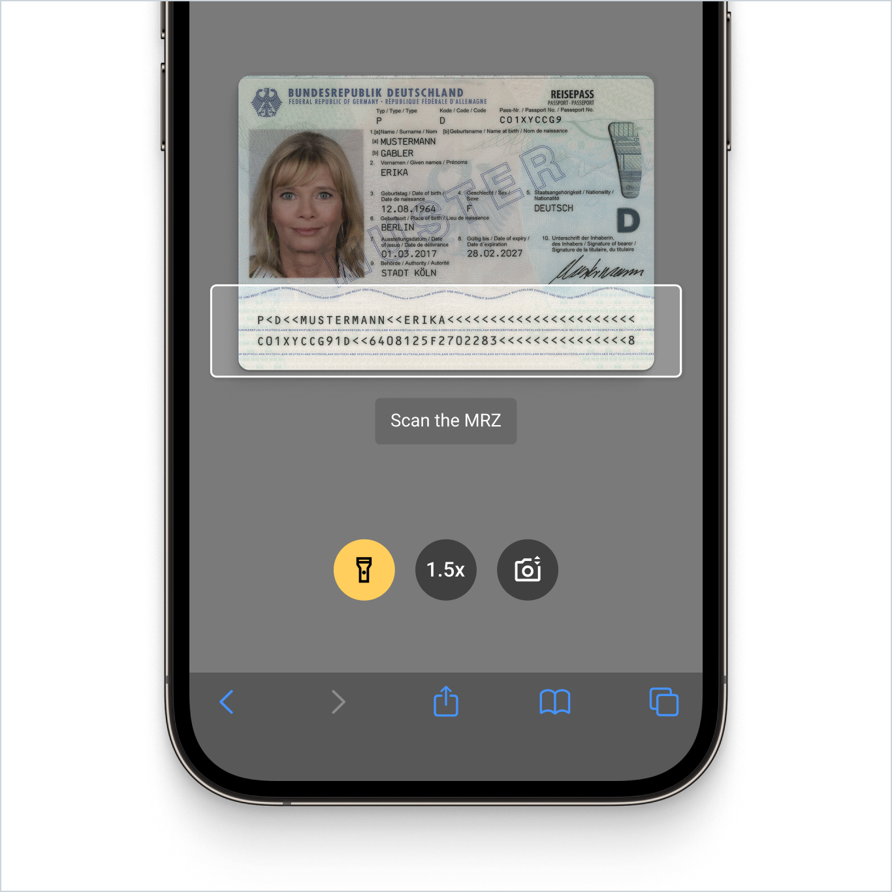

<p align="left">
  
</p>
<p align="left">
  
</p>

# Example app for the Scanbot Web Barcode Scanner and Document Scanner SDK

This example app shows how to integrate the Scanbot Barcode Scanner SDK, Document Scanner SDK, and Data Capture functionalities into your web applications.

## What is the Scanbot SDK?

The Scanbot SDK is a set of high-level APIs that lets you integrate barcode and document scanning, as well as data extraction functionalities, into your website. It runs in all common web browsers, such as Chrome, Safari, Firefox, or Edge, and operates entirely on the user's device. No data is transmitted to our or third-party servers.

The SDK can be implemented into your web app with just a few lines of code and comes with Ready-To-Use UI components.

💡 For more details about the Scanbot Web SDK, please see our [Barcode Scanner](https://docs.scanbot.io/web/barcode-scanner-sdk/introduction/?utm_source=github.com&utm_medium=referral&utm_campaign=dev_sites) or [Document Scanner](https://docs.scanbot.io/web/document-scanner-sdk/introduction/?utm_source=github.com&utm_medium=referral&utm_campaign=dev_sites) documentation.

## How to run this example app?

### React App

The React example app relies on the Scanbot SDK's [npm package](https://www.npmjs.com/package/scanbot-web-sdk).

To run the React example app:

```
cd react-js/
npm install
npm start
```

### Vue.js App

Like the React example app, the Vue.js example app relies on the Scanbot SDK's [npm package](https://www.npmjs.com/package/scanbot-web-sdk).

To run the Vue.js example app:

```
cd vue-js/
npm install
npm run dev
```

### Plain JavaScript App

The vanilla JavaScript app needs to download the SDK from npm. To do this, run the script

```
plain-js/download-sdk.sh
```

To run the JavaScript example:

```
cd plain-js/
php -S localhost:8000
```

## Overview of the Scanbot SDK

### Barcode Scanner SDK

The Scanbot [Barcode Scanner SDK for the web](https://scanbot.io/barcode-scanner-sdk/web-barcode-scanner/?utm_source=github.com&utm_medium=referral&utm_campaign=dev_sites) allows you to integrate fast and accurate barcode scanning capabilities into your web apps.

Barcodes are scanned in just 0.04 seconds, and scans remain precise even under challenging conditions, including damaged, small, or distant barcodes and low-light environments.

#### Out-of-the-box barcode scanning workflows

The Scanbot Barcode Scanner SDK offers the following scan modes, available out-of-the-box in our ready-to-use UI:
* Single Scanning
* Batch & Multi Scanning
* Find & Pick
* Scan & Count

|  |  |  |
| :-- | :-- | :-- |

#### Scanning barcodes from an image

The Scanbot Web Barcode Scanner SDK also supports still images, enabling you to scan barcodes and QR Codes from JPG and other image files. It supports single-image and multi-image detection and returns a list with the recognized barcodes.

#### Supported barcode formats

The Web Barcode Scanner library supports all common 1D- or 2D barcodes and multiple postal symbologies, including:

| Barcode type       | Barcode symbologies                                                                                                                                                                                                                                                                                                                                                                                                                                                                                                                                                                                                                                                                                                                                                                                                                                                                                                                                                                                                                                                                                                                                                                                                                                            |
|:-------------------|:---------------------------------------------------------------------------------------------------------------------------------------------------------------------------------------------------------------------------------------------------------------------------------------------------------------------------------------------------------------------------------------------------------------------------------------------------------------------------------------------------------------------------------------------------------------------------------------------------------------------------------------------------------------------------------------------------------------------------------------------------------------------------------------------------------------------------------------------------------------------------------------------------------------------------------------------------------------------------------------------------------------------------------------------------------------------------------------------------------------------------------------------------------------------------------------------------------------------------------------------------------------|
| 1D Barcodes        | [EAN](https://scanbot.io/barcode-scanner-sdk/ean/?utm_source=github.com&utm_medium=referral&utm_campaign=dev_sites), [UPC](https://scanbot.io/barcode-scanner-sdk/upc/?utm_source=github.com&utm_medium=referral&utm_campaign=dev_sites), [Code 128](https://scanbot.io/barcode-scanner-sdk/code-128/?utm_source=github.com&utm_medium=referral&utm_campaign=dev_sites), [GS1-128](https://scanbot.io/barcode-scanner-sdk/gs1-128/?utm_source=github.com&utm_medium=referral&utm_campaign=dev_sites), [Code 39](https://scanbot.io/barcode-scanner-sdk/code-39/?utm_source=github.com&utm_medium=referral&utm_campaign=dev_sites), [Codabar](https://scanbot.io/barcode-scanner-sdk/codabar/?utm_source=github.com&utm_medium=referral&utm_campaign=dev_sites), [ITF](https://scanbot.io/barcode-scanner-sdk/itf-code/?utm_source=github.com&utm_medium=referral&utm_campaign=dev_sites), Code 25, Code 32, Code 93, Code 11, MSI Plessey, Standard 2 of 5, IATA 2 of 5, Databar (RSS), GS1 Composite                                                                                                                                                                                                                                                                                                                        |
| 2D Barcodes        | [QR Code](https://scanbot.io/glossary/qr-code/?utm_source=github.com&utm_medium=referral&utm_campaign=dev_sites), [Micro QR Code](https://scanbot.io/barcode-scanner-sdk/micro-qr-code/?utm_source=github.com&utm_medium=referral&utm_campaign=dev_sites), [Aztec Code](https://scanbot.io/barcode-scanner-sdk/aztec-code/?utm_source=github.com&utm_medium=referral&utm_campaign=dev_sites), [PDF417 Code](https://scanbot.io/barcode-scanner-sdk/pdf417/?utm_source=github.com&utm_medium=referral&utm_campaign=dev_sites), [Data Matrix Code,](https://scanbot.io/barcode-scanner-sdk/data-matrix/?utm_source=github.com&utm_medium=referral&utm_campaign=dev_sites) [GiroCode](https://scanbot.io/glossary/giro-code/?utm_source=github.com&utm_medium=referral&utm_campaign=dev_sites), [NTIN Code](https://scanbot.io/glossary/gtin/?utm_source=github.com&utm_medium=referral&utm_campaign=dev_sites), [PPN](https://scanbot.io/glossary/ppn/?utm_source=github.com&utm_medium=referral&utm_campaign=dev_sites), [UDI](https://scanbot.io/glossary/udi/?utm_source=github.com&utm_medium=referral&utm_campaign=dev_sites), [Royal Mail Mailmark](https://scanbot.io/barcode-scanner-sdk/royal-mail/?utm_source=github.com&utm_medium=referral&utm_campaign=dev_sites), MaxiCode |
| Postal Symbologies | USPS Intelligent Mail Barcode (IMb), Royal Mail RM4SCC Barcode, Australia Post 4-State Customer Code, Japan Post 4-State Customer Code, KIX                                                                                                                                                                                                                                                                                                                                                                                                                                                                                                                                                                                                                                                                                                                                                                                                                                                                                                                                                                                                            |

💡 Please visit our [docs](https://docs.scanbot.io/web/barcode-scanner-sdk/supported-barcode-symbologies/?utm_source=github.com&utm_medium=referral&utm_campaign=dev_sites) for a complete overview of the supported barcode symbologies.

#### Data Parsers

The Scanbot Web Barcode Scanner SDK supports a variety of data parsers that extract structured information from 2D barcodes such as QR Codes and Data Matrix. These include parsers for documents such as driving licences (AAMVA), boarding passes, medical certificates, SEPA forms, Swiss QR codes and vCard business cards. 

💡 Please refer to our [documentation](https://docs.scanbot.io/web/barcode-scanner-sdk/supported-barcode-symbologies/?utm_source=github.com&utm_medium=referral&utm_campaign=dev_sites#supported-barcode-data-parsers) for a full list of supported data parsers.

### Document Scanner SDK

The Scanbot Web Document Scanner SDK offers the following features:

* **User guidance**: Ease of use is crucial for large user bases. Our on-screen user guidance helps even non-tech-savvy users create perfect scans.

* **Automatic capture**: The SDK automatically captures the document when the device is optimally positioned over the document. This reduces the risk of blurry or incomplete document scans compared to manually-triggered capture.

* **Automatic cropping**: Our document scanning SDK automatically straightens and crops scanned documents, ensuring high-quality document scan results.

* **Document Quality Analyzer:** This feature automatically rates the quality of the scanned pages from “very poor” to “excellent.” If the quality is below a specified threshold, the SDK prompts the user to rescan.

* **Export formats:** The SDK supports various formats for exporting and processing documents (JPG, PDF, TIFF, and PNG). This ensures your downstream solutions receive the best format to store, print, or share the digitized document – or to process it further.

|  |  |  |
| :-- | :-- | :-- |

### Data Capture Modules

The Scanbot SDK Data Capture Modules allow you to extract data from a wide range of documents, including [MRZ codes](https://scanbot.io/data-capture-software/mrz-scanner/?utm_source=github.com&utm_medium=referral&utm_campaign=dev_sites) on identity documents, [Checks](https://scanbot.io/data-capture-software/check-scanner/?utm_source=github.com&utm_medium=referral&utm_campaign=dev_sites), [U.S.](https://scanbot.io/data-capture-software/us-drivers-license-scanner/?utm_source=github.com&utm_medium=referral&utm_campaign=dev_sites) and [German driver’s licenses](https://scanbot.io/data-capture-software/german-drivers-license-scanner/?utm_source=github.com&utm_medium=referral&utm_campaign=dev_sites), [EHICs](https://scanbot.io/data-capture-software/ehic-scanner/?utm_source=github.com&utm_medium=referral&utm_campaign=dev_sites), [German ID cards](https://scanbot.io/data-capture-software/id-scanner/?utm_source=github.com&utm_medium=referral&utm_campaign=dev_sites), and [German residence permit cards](https://scanbot.io/data-capture-software/residence-permit-scanner/?utm_source=github.com&utm_medium=referral&utm_campaign=dev_sites) and to integrate [OCR](https://scanbot.io/data-capture-software/ocr-sdk/?utm_source=github.com&utm_medium=referral&utm_campaign=dev_sites) text recognition capabilities.

<p align="left">
  
</p>

## Additional information

### Free integration support

Need help integrating or testing our Barcode Scanner or Document Scanner SDKs? We offer [free developer support](https://docs.scanbot.io/support/?utm_source=github.com&utm_medium=referral&utm_campaign=dev_sites) via Slack, MS Teams, or email.

As a customer, you also get access to a dedicated support Slack or Microsoft Teams channel to talk directly to your Customer Success Manager and our engineers.

### Licensing and pricing

These examples will run one minute per session without a license. After that, all functionalities and UI components will stop working. 

To try the Scanbot SDK without the one-minute limit, you can request a free, no-strings-attached [7-day trial license](https://docs.scanbot.io/trial/?utm_source=github.com&utm_medium=referral&utm_campaign=dev_sites).

Alternatively, check out our [demo apps](https://scanbot.io/demo-apps/?utm_source=github.com&utm_medium=referral&utm_campaign=dev_sites) to test the SDK.

Our pricing model is simple: Unlimited barcode scanning for a flat annual license fee, full support included. There are no tiers, usage charges, or extra fees. [Contact](https://scanbot.io/contact-sales/?utm_source=github.com&utm_medium=referral&utm_campaign=dev_sites) our team to receive your quote.

### Other supported platforms

The Scanbot SDK is also available as a native SDK or for most common cross-plattform frameworks:

#### Barcode Scanner SDK

* [Android (native)](https://github.com/doo/scanbot-barcode-scanner-sdk-example-android)
* [iOS (native)](https://github.com/doo/scanbot-barcode-scanner-sdk-example-ios)
* [React Native](https://github.com/doo/scanbot-barcode-scanner-sdk-example-react-native)
* [Flutter](https://github.com/doo/scanbot-barcode-scanner-sdk-example-flutter)
* [Capacitor & Ionic](https://github.com/doo/scanbot-barcode-scanner-sdk-example-capacitor-ionic)
* [Cordova & Ionic](https://github.com/doo/scanbot-barcode-scanner-sdk-example-cordova-ionic)
* [Compose Multiplatform / KMP](https://github.com/doo/scanbot-barcode-scanner-sdk-example-kmp)
* [Xamarin & Xamarin.Forms](https://github.com/doo/scanbot-barcode-scanner-sdk-example-xamarin)
* [UWP](https://github.com/doo/scanbot-barcode-scanner-sdk-example-windows)
* [Linux](https://github.com/doo/scanbot-sdk-example-linux)

#### Document Scanner SDK

* [Android (native)](https://github.com/doo/scanbot-sdk-example-android)
* [iOS (native)](https://github.com/doo/scanbot-sdk-example-ios)
* [Flutter](https://github.com/doo/scanbot-sdk-example-flutter)
* [Capacitor & Ionic (Angular)](https://github.com/doo/scanbot-sdk-example-capacitor-ionic)
* [Capacitor & Ionic (React)](https://github.com/doo/scanbot-sdk-example-ionic-react)
* [Capacitor & Ionic (Vue.js)](https://github.com/doo/scanbot-sdk-example-ionic-vuejs)
* [Cordova & Ionic](https://github.com/doo/scanbot-sdk-example-ionic)
* [.NET MAUI](https://github.com/doo/scanbot-sdk-maui-example)
* [React Native](https://github.com/doo/scanbot-sdk-example-react-native)
* [Xamarin](https://github.com/doo/scanbot-sdk-example-xamarin) & [Xamarin.Forms](https://github.com/doo/scanbot-sdk-example-xamarin-forms)

